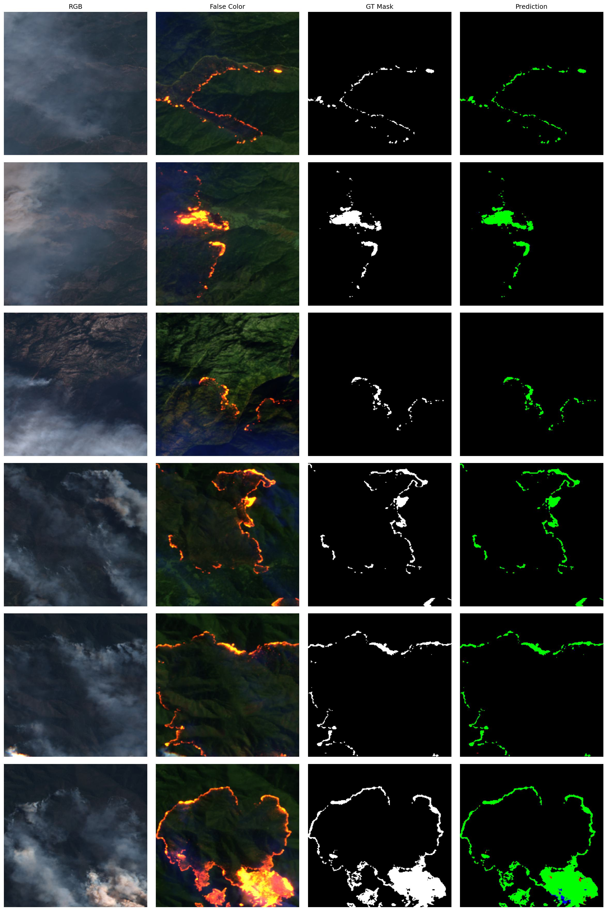

<H1 align="center" style="color:darkviolet"> SENTINEL2 FOREST FIRES DETECTION </H1>

<p align="center">
<br>
</p>

## Educational Notebook to train a deep learning model to detect forest fires using sentinel-2 multi-spectral satellite imagery


<p align="center">
<br>
</p>


<div id="top"></div>
<!-- TABLE OF CONTENTS -->
<details>
  <summary>Table of Contents</summary>
  <ol>
    <li><a href="#about-this-repository">About this repository</a></li>
    <li>
      <a href="#getting-Started">Getting started</a>
    </li>
    <li>
        <a href="#usage">Usage</a>
        <ul>
            <li><a href="#demo_running">Demo running</a></li>
            <li><a href="#data_structure">Data structure</a></li>
        </ul>
    </li>
    <li><a href="#license">License</a></li>
    <li><a href="#contact">Contact</a></li>
    <!-- <li><a href="#references">References</a></li> -->
  </ol>
</details>


<!-- ABOUT THE PROJECT -->

## <div id="about-this-repository">1. About this repository 💼 </div>

This git repository contains a Notebook to perform forest fire detection using deep learning. 
The demo consists of loading the dataset, create several models trying to get good results and make the inference on some sample images.


### <div id="packages"> This demo is built with </div>

* [Anaconda](https://www.anaconda.com/products/distribution)
* [Python](https://www.python.org/)
* [Tensorflow](https://www.tensorflow.org/)
* [Matplotlib](https://matplotlib.org/)
* [NumPy](https://numpy.org/)

<p align="right">(<a href="#top">back to top</a>)</p>


<!-- GETTING STARTED -->

## <div id="getting-Started"> 2.1 Getting Started (Colab)📚  </div>

* Open this link in a new tab (CTRL+Click or Middle_click): [Run colab from this github](https://githubtocolab.com/ThomasLOUIS1/TP_wildfire_segmentation_ETU.git)

* Choose : 
    - Branche : main
    - Click "TP_wildfire.ipynb"

* Then :
    - :uk: go to Runtime >> Change runtime type >> Choose GPU
    - :fr: go to Execution >> Modifier le type d'éxecution >> Choose GPU
## <div id="getting-Started"> 2.2 Getting Started (linux)📚  </div>

Follow these instructions to setup your project.


* [Install miniconda](https://docs.conda.io/projects/conda/en/latest/user-guide/install/linux.html) or [anaconda](https://www.anaconda.com/products/distribution)
* Creat a new conda environment called wildfire_segmentation_env and activate it

        conda create -n wildfire_segmentation_env -y python==3.9
        conda activate wildfire_segmentation_env

* Install [tensorflow]() and cudatools 11.2 and cudnn 8.1.0. Verify that your GPU is recognized.

        conda install -c conda-forge cudatoolkit=11.2 cudnn=8.1.0
        export LD_LIBRARY_PATH=$LD_LIBRARY_PATH:$CONDA_PREFIX/lib/
        python -m pip install tensorflow
        # Verify install:
        python -c "import tensorflow as tf; print(tf.config.list_physical_devices('GPU'))"


- Clone the repo and go to its root directory.

  ```sh
  git clone "https://github.com/ThomasLOUIS1/TP_wildfire_segmentation_ETU.git"
  
  cd TP_wildfire_segmentation_ETU/
  ```

- Install the rest of the environemnt:

        pip install requirement.txt


<p align="right">(<a href="#top">back to top</a>)</p>


<!-- USAGE EXAMPLES -->

## <div id="usage">3. Usage 📒 </div>

### <div id="demo_running"> Demo running</div>

The jupyter nootebook is not installed in the Wildfire_segmentation env created by <a href="https://github.com/ThomasLOUIS1/Wildfire_segmentation/Wildfire_segmentation_env.yml">Wildfire_segmentation_env.yml </a> file.

🚨 To run the notebook **TP_wildfire.ipynb** you have to install **jupyter** package in your active (Wildfire_segmentation) environment
```bash
conda install -c anaconda jupyter
```

🏁 Run the notebook [**TP_wildfire.ipynb**](https://github.com/ThomasLOUIS1/TP_wildfire_segmentation_ETU/TP_wildfire_-_ETU.ipynb)

```bash
jupyter notebook TP_wildfire_-_ETU.ipynb
```

**✍ NOTES:**

- [**TP_wildfire.ipynb**](https://github.com/ThomasLOUIS1/Wildfire_segmentation/TP_wildfire_segmentation_ETU.ipynb) will use some function declared in
  utils.py and metrics_and_losses.py
  (<a href="#data_structure">bellow</a>).


**✍ NOTES:**

- The data folder only contains a .zip to extract to get the following dataset : 
    - **false_color_full** folder contains images composed by [B12,B11,B04] (sentinel2 bands) used as the input for training. 
    - **RGB** contains 6 images corresponding to RGB images used only for visualizing.
    - **masks_full** folder contains binary masks (**value : 0=no-fire; value : 1=fire**) used as labels for training.

👉 For more information about the data please read this ([__Readme__](https://ciar.irt-saintexupery.com/index.php/s/3RLvFSak6Qt7NnB/download?path=%2Fwildifre_data_20m&files=ReadMe_20m.md))

<p align="right">(<a href="#top">back to top</a>)</p>


<!-- LICENSE -->


## <div id="license">4. License 📑</div>

Distributed under the Attribution 4.0 International (CC BY 4.0) License. 

Contains modified Copernicus Sentinel data [2016-2020] for Sentinel data

<p align="right">(<a href="#top">back to top</a>)</p>


<!-- CONTACT -->


## <div id="contact">5. Contact 📭</div>

* [Thomas LOUIS 📧](mailto:thomas.louis@irt-saintexupery.com)
* [Alain PEGATOQUET 📧] (mailto:(mailto:alain.pegatoquet@unice.fr))


Project Link: [https://github.com/ThomasLOUIS1/TP_wildfire_segmentation_ETU](https://github.com/ThomasLOUIS1/TP_wildfire_segmentation_ETU)

<p align="right">(<a href="#top">back to top</a>)</p>


<!-- REFERENCES -->

<!-- ## <div id="references">5. References 📭 </div>


<p align="right">(<a href="#top">back to top</a>)</p> -->

