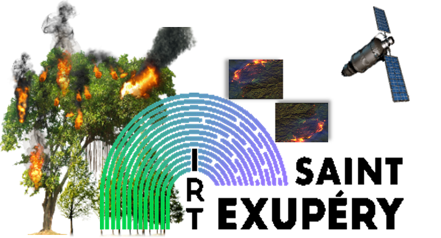

<H1 align="center" style="color:darkviolet"> SENTINEL2 FOREST FIRES DETECTION </H1>

<p align="center">
<br>
</p>

## Educational Notebook to train a deep learning model to detect forest fires using sentinel-2 multi-spectral satellite imagery


<p align="center">
<br>
</p>

**Multi-spectral images** are images representing the same area in **multiple wavelength band**. They are very useful for wildfire segmentation because they can provide more information about the characteristics of the wildfire and the surrounding area than RGB images. 

For example, near-infrared (NIR) bands can be used to identify vegetation, while shortwave infrared (SWIR) bands can be used to detect the presence of smoke. Additionally, using multiple wavelength bands can help to reduce the impact of atmospheric conditions such as clouds and haze on the image. This **can improve the accuracy of the segmentation task** and make it easier to **identify a wildfire** in an image.

These images are stored in `.tif files`. **TIFF** is a widely-used **file format for images**. It is capable of storing images in a lossless format, meaning that **no data is lost when the image is compressed**. This makes it a popular choice for storing **high-quality images**, such as those used in professional photography, printing or satellite imagery.
                                 
Above are four **256x256** images :
 - RGB images where each pixel is an 8-bit unsigned integer (uint8)
 - The reconstructed images from the 3 spectral bands in uint8 (named "False Color")
 - The binary masks of segmentation (named "GT Mask"). This is an "image" of the same size as the original reconstructed image but with values 0 and 1 (**Black/1 = no-fire; White/0 = fire**)
 - Some predictions performed by a neural network (named "Prediction").


<div id="top"></div>
<!-- TABLE OF CONTENTS -->
<details>
  <summary>Table of Contents</summary>
  <ol>
    <li><a href="#about-this-repository">About this repository</a></li>
    <li>
      <a href="#getting-Started">Getting started</a>
    </li>
    <li>
        <a href="#usage">Usage</a>
        <ul>
            <li><a href="#Notebook_running">Notebook running</a></li>
            <li><a href="#data_structure">Data structure</a></li>
        </ul>
    </li>
    <li><a href="#license">License</a></li>
    <li><a href="#contact">Contact</a></li>
    <!-- <li><a href="#references">References</a></li> -->
  </ol>
</details>


<!-- ABOUT THE PROJECT -->

## <div id="about-this-repository">1. About this repository 💼 </div>

This git repository contains a Notebook to perform forest fire detection using deep learning. 
The Notebook consists in loading the dataset, creating several models trying to get good results and making the inference on some sample images.


### <div id="packages"> This Notebook is built with </div>

* [Anaconda](https://www.anaconda.com/products/distribution)
* [Python](https://www.python.org/)
* [Tensorflow](https://www.tensorflow.org/)
* [scikit-learn](https://scikit-learn.org/)
* [Matplotlib](https://matplotlib.org/)
* [NumPy](https://numpy.org/)

<p align="right">(<a href="#top">back to top</a>)</p>


<!-- GETTING STARTED -->

## <div id="getting-Started"> 2.1 Getting Started (Colab)📚  </div>

* Open this link in a new tab (CTRL+Click or Middle_click): [Run colab from this github](https://githubtocolab.com/ThomasLOUIS1/Wildfire_segmentation.git)

* Choose : 
    - Branche : main
    - Click "TP_wildfire.ipynb"

* Then :
    - :uk: go to Runtime >> Change runtime type >> Choose GPU
    - :fr: go to Execution >> Modifier le type d'éxecution >> Choose GPU
## <div id="getting-Started"> 2.2 Getting Started (linux)📚  </div>

Follow these instructions to setup your project.


* [Install miniconda](https://docs.conda.io/projects/conda/en/latest/user-guide/install/linux.html) or [anaconda](https://www.anaconda.com/products/distribution)
* Creat a new conda environment called wildfire_segmentation_env and activate it

        conda create -n wildfire_segmentation_env -y python==3.9
        conda activate wildfire_segmentation_env

* Install [tensorflow]() and cudatools 11.2 and cudnn 8.1.0. Verify that your GPU is recognized.

        conda install -c conda-forge cudatoolkit=11.2 cudnn=8.1.0
        export LD_LIBRARY_PATH=$LD_LIBRARY_PATH:$CONDA_PREFIX/lib/
        python -m pip install tensorflow
        # Verify install:
        python -c "import tensorflow as tf; print(tf.config.list_physical_devices('GPU'))"


- Clone the repo and go to its root directory.

  ```sh
  git clone "https://github.com/ThomasLOUIS1/Wildfire_segmentation.git"
  
  cd Wildfire_segmentation/
  ```

- Install the rest of the environemnt:

        pip install requirement.txt


<p align="right">(<a href="#top">back to top</a>)</p>


<!-- USAGE EXAMPLES -->

## <div id="usage (linux)">3. Usage 📒 </div>

### <div id="Notebook_running"> Notebook running</div>

The jupyter librairy is not installed in the Wildfire_segmentation env created by <a href="https://github.com/ThomasLOUIS1/Wildfire_segmentation/Wildfire_segmentation_env.yml">Wildfire_segmentation_env.yml </a> file.

🚨 To run the notebook **TP_wildfire.ipynb** you have to install **jupyter** package in your active (Wildfire_segmentation) environment
```bash
conda install -c anaconda jupyter
```

🏁 Run the notebook [**TP_wildfire.ipynb**](https://github.com/ThomasLOUIS1/Wildfire_segmentation/TP_wildfire.ipynb)

```bash
jupyter notebook TP_wildfire.ipynb
```

**✍ NOTES:**

- [**TP_wildfire.ipynb**](https://github.com/ThomasLOUIS1/Wildfire_segmentation/TP_wildfire.ipynb) will use some function declared in
  utils.py and metrics_and_losses.py
  (<a href="#data_structure">bellow</a>).


- The data folder only contains a .zip to extract to get the following dataset : 
    - **false_color** folder contains images composed by [B12,B11,B04] (sentinel2 bands) used as the input for training. 
    - **RGB** contains 15 images corresponding to RGB images used only for visualizing.
    - **masks** folder contains binary masks (**value : 0=no-fire; value : 1=fire**) used as labels for training.


<p align="right">(<a href="#top">back to top</a>)</p>


<!-- LICENSE -->


## <div id="license">4. License 📑</div>

Distributed under the Attribution 4.0 International (CC BY 4.0) License. 

Contains modified Copernicus Sentinel data [2016-2020] for Sentinel data

<p align="right">(<a href="#top">back to top</a>)</p>


<!-- CONTACT -->


## <div id="contact">5. Contact 📭</div>

* [Thomas LOUIS 📧](mailto:thomas.louis@irt-saintexupery.com)
* [Alain PEGATOQUET 📧](mailto:alain.pegatoquet@univ-cotedazur.fr)


Project Link: [https://github.com/ThomasLOUIS1/Wildfire_segmentation](https://github.com/ThomasLOUIS1/Wildfire_segmentation)

<p align="right">(<a href="#top">back to top</a>)</p>


<!-- REFERENCES -->

<!-- ## <div id="references">5. References 📭 </div>


<p align="right">(<a href="#top">back to top</a>)</p> -->

